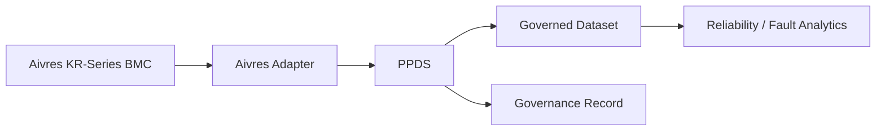
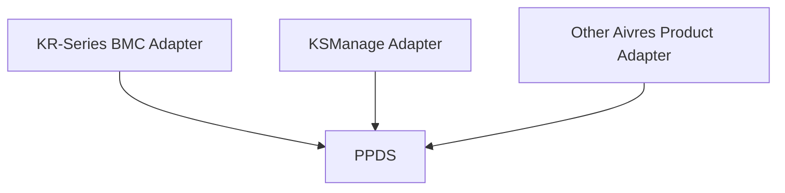

# PPDS × Aivres KR-Series BMC Proof of Concept Design

**Use Case:** Fleet Reliability and Fault Analysis

**Execution Mode:** Batch

---

## 1. Objective

This PoC validates whether the existing PPDS infrastructure can integrate with Aivres KR-Series BMC data and produce governed datasets for downstream engineering analysis.

The PoC evaluates two questions:

1. Can KR-Series BMC data be integrated with PPDS through a lightweight adapter and configuration layer?
2. Can the same integration pattern be reused across additional Aivres products with limited PPDS core changes?

---

## 2. Architecture



Aivres-specific implementation is limited to:

* source integration;
* schema and metadata mapping;
* PPDS configuration; and
* output integration.

PPDS remains the shared governance infrastructure.

---

## 3. Integration Design

### Input

The PoC ingests a bounded BMC dataset covering:

* device and configuration data;
* events and alerts;
* diagnostic and fault data;
* system logs; and
* operational telemetry.

The preferred source interface is **Redfish / REST** or an equivalent structured BMC export.

Each run uses a fixed source snapshot to support reproducible testing.

### Adapter

The Aivres adapter performs:

```text
BMC Extraction
      ↓
Schema Normalization
      ↓
Aivres-to-PPDS Mapping
      ↓
Input Validation
      ↓
PPDS
```

The mapping and configuration are versioned independently from PPDS.

### Output

PPDS produces:

1. **Governed Dataset**
   Used by reliability and engineering analytics.

2. **Governance Record**
   Records the source version, mapping/configuration version, PPDS version, execution decision, and output reference.

---

## 4. Execution Flow


A PoC run consists of:

1. extract and freeze BMC data;
2. map the source into the PPDS input contract;
3. validate the configuration;
4. execute PPDS;
5. materialize the governed output;
6. validate governance correctness and engineering utility.

Failed validation prevents the governed output from being released to the analytical workflow.

---

## 5. Test and Evaluation

### Integration

Validate the complete path:

```text
BMC → Adapter → PPDS → Governed Dataset
```

**Pass:** the workflow executes end-to-end using the defined interfaces.

### Correctness

Compare PPDS decisions and resulting output against an agreed validation set.

Validate:

* field handling;
* required transformations;
* output schema;
* required relationships.

**Pass:** critical governance requirements are applied correctly.

### Engineering Utility

Run a predefined reliability-analysis workload against the governed dataset.

The workload should cover:

* component reliability;
* fault patterns;
* firmware/configuration relationships;
* telemetry-to-failure relationships; and
* longitudinal device analysis where required.

**Pass:** the governed dataset supports all agreed analyses.

### Reproducibility

Repeat the PoC using the same:

* source snapshot;
* adapter/mapping version;
* PPDS configuration;
* PPDS version.

**Pass:** equivalent inputs produce equivalent PPDS decisions and governed outputs.

### Performance

Measure:

* total batch execution time;
* processing throughput; and
* PPDS-related processing overhead.

**Pass:** processing performance meets the threshold agreed for the representative Aivres workload.

---

## 6. Portability Validation

The KR-Series BMC integration serves as the first Aivres reference implementation.

The expected reusable model is:



For a second Aivres product, evaluate how much implementation can be reused.

Expected product-specific changes are limited to:

* source adapter;
* schema mapping;
* configuration; and
* output contract.

**Pass:** the second integration can be designed primarily through these components while preserving the existing PPDS core.

---

## 7. Deliverables

The PoC produces:

* Aivres BMC adapter;
* Aivres-to-PPDS mapping and configuration;
* governed analytical output;
* governance record;
* integration and correctness test results;
* engineering-utility evaluation;
* reproducibility test results;
* batch-performance results; and
* portability assessment for one additional Aivres product.

---

## 8. Success Criteria

The PoC is successful when:

1. Aivres KR-Series BMC data can be processed end-to-end through PPDS.
2. Aivres-specific implementation remains concentrated in the adapter and configuration layers.
3. The governed output supports the selected reliability and fault-analysis workflow.
4. Results are reproducible from the same source and configuration versions.
5. Batch performance is practical for the representative workload.
6. The integration pattern can be reused for an additional Aivres product with limited incremental implementation.

The PoC therefore validates both **Aivres BMC compatibility** and **PPDS portability across the broader Aivres product environment**.
