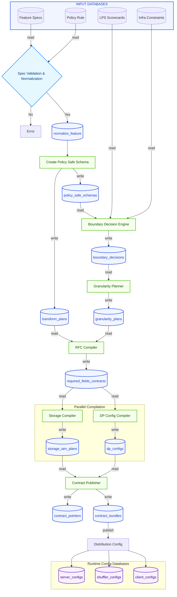

# Control Plane Flowchart

```mermaid
graph TB
    %% ==============================================
    %% DATABASE INPUTS
    %% ==============================================
    
    subgraph DB_INPUTS [INPUT DATABASES]

        direction LR
        FS[(Feature Specs)]
        PR[(Policy Rule)]
        LP[(LPS Scorecards)]
        IC[(Infra Constraints)]
    end
    
    FS -->|read| C1
    PR -->|read| C1
    LP -->|read| C3
    IC -->|read| C3
    
    %% ==============================================
    %% PROCESSING PIPELINE
    %% ==============================================
    
    C1{"Spec Validation & Normalization"}
    
    C1 -->|Yes| NF[(normalize_feature)]
    C1 -->|No| Error["Error"]
    
    NF --> C2
    
    C2["Create Policy Safe Schema"]
    
    C2 -->|write| PSS[(policy_safe_schemas)]
    C2 -->|write| TP[(transform_plans)]
    
    PSS -->|read| C3
    TP -->|read| C5
    
    C3["Boundary Decision Engine"]
    
    C3 -->|write| BD[(boundary_decisions)]
    
    BD -->|read| C4
    
    C4["Granularity Planner"]
    
    C4 -->|write| GP[(granularity_plans)]
    
    GP -->|read| C5
    
    %% ==============================================
    %% CONTRACT COMPILATION 
    %% ==============================================
    
    C5["RFC Compiler"]
    
    C5 -->|write| RFC[(required_fields_contracts)]
    
    RFC -->|read| C6
    RFC -->|read| C7
    
    subgraph PARALLEL_COMPILE [Parallel Compilation]
        direction LR
        
        C6["DP Config Compiler"]
        C7["Storage Compiler"]
        
        C6 -->|write| DPC[(dp_configs)]
        C7 -->|write| SIP[(storage_iam_plans)]
    end
    
    DPC -->|read| C8
    SIP -->|read| C8
    
    %% ==============================================
    %% PUBLISH & DISTRIBUTE 
    %% ==============================================
    
    C8["Contract Publisher"]
    
    C8 -->|write| CB[(contract_bundles)]
    C8 -->|write| ACP[(contract_pointers)]
    
    CB -->|publish| DIST_CONFIG["Distribution Config"]
    
    DIST_CONFIG --> CLIENT
    DIST_CONFIG --> SHUFFLER
    DIST_CONFIG --> SERVER
    
    subgraph CONFIG_DISTRIBUTION [Runtime Config Databases]
        direction LR
        
        CLIENT[(client_configs)]
        SHUFFLER[(shuffler_configs)]
        SERVER[(server_configs)]
    end
    
    %% ==============================================
    %% ClassDef
    %% ==============================================
    
    classDef database fill:#f0f5ff,stroke:#2f54eb,stroke-width:2px,color:#1d39c4
    classDef decision fill:#e6f7ff,stroke:#1890ff,stroke-width:2px,color:#003a8c
    classDef process fill:#f6ffed,stroke:#52c41a,stroke-width:2px,color:#135200
    classDef config fill:#f9f0ff,stroke:#722ed1,stroke-width:2px,color:#391085
    
    %% Class
    class DB_INPUTS,NF,PSS,TP,BD,GP,RFC,DPC,SIP,CB,ACP database
    class C1 decision
    class C2,C3,C4,C5,C6,C7,C8 process
    class CLIENT,SHUFFLER,SERVER config
    class PARALLEL_COMPILE,CONFIG_DISTRIBUTION fill:none,stroke:none
```
