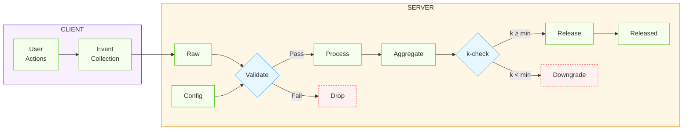

```mermaid
graph LR
    %% CENTRAL DP
    %% CLIENT
    subgraph CLIENT_CDP [CLIENT]
        C1["User<br>Actions"]
        C2["Event<br>Collection"]
        C1 --> C2
    end
    
    %% SERVER
    subgraph SERVER_CDP [SERVER]
        IN1["Raw"]
        IN2["Config"]
        VAL{"Validate"}
        PROC["Process"]
        AGG["Aggregate"]
        KCHECK{"k-check"}
        DP["Release"]
        OUT["Released"]
        DROP["Drop"]
        DOWN["Downgrade"]
        
        IN1 --> VAL
        IN2 --> VAL
        VAL -->|Pass| PROC
        VAL -->|Fail| DROP
        PROC --> AGG
        AGG --> KCHECK
        KCHECK -->|k ≥ min| DP
        KCHECK -->|k < min| DOWN
        DP --> OUT
    end
    
    C2 --> IN1
    
    %% format
    classDef client fill:#f9f0ff,stroke:#722ed1
    classDef server fill:#fff7e6,stroke:#fa8c16
    classDef gate fill:#e6f7ff,stroke:#1890ff
    classDef process fill:#f6ffed,stroke:#52c41a
    classDef reject fill:#fff1f0,stroke:#ff4d4f,stroke-dasharray: 3 3
    
    class CLIENT_CDP client
    class SERVER_CDP server
    class C1,C2,IN1,IN2,OUT process
    class VAL,KCHECK gate
    class PROC,AGG,DP process
    class DROP,DOWN reject
```
