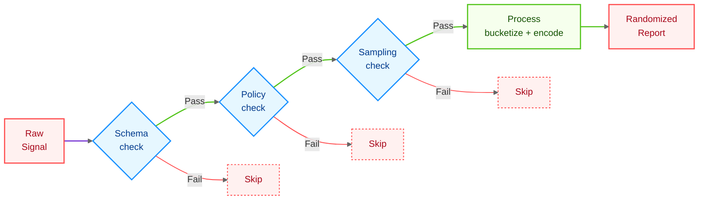

# LOCAL DP

```mermaid
graph LR
    %% ==============================================
    %% LOCAL DP PATH
    %% ==============================================
    
    %% Main Chart
    A["Raw<br>Signal"] --> B{"Schema<br>check"}
    B -->|Pass| C{"Policy<br>check"}
    C -->|Pass| D{"Sampling<br>check"}
    D -->|Pass| E["Process<br>bucketize + encode"]
    E --> F["Randomized<br>Report"]
    
    %% fail path
    B -->|Fail| X["Skip"]
    C -->|Fail| Y["Skip"]
    D -->|Fail| Z["Skip"]
    
    %% ==============================================
    %% Format
    %% ==============================================
    
    classDef data fill:#fff1f0,stroke:#ff4d4f,stroke-width:2px,color:#a8071a
    classDef gate fill:#e6f7ff,stroke:#1890ff,stroke-width:2px,color:#003a8c
    classDef process fill:#f6ffed,stroke:#52c41a,stroke-width:2px,color:#135200
    classDef reject fill:#fff1f0,stroke:#ff4d4f,stroke-width:1.5px,color:#a8071a,stroke-dasharray: 3 3
    
    %% Class
    class A,F data
    class B,C,D gate
    class E process
    class X,Y,Z reject
    
    %% Linkstyle
    linkStyle default stroke:#666,stroke-width:1.5px
    linkStyle 0 stroke:#722ed1,stroke-width:2px
    linkStyle 1,2,3,4 stroke:#52c41a,stroke-width:2px
    linkStyle 5,6,7 stroke:#ff4d4f,stroke-width:1.5px
```
