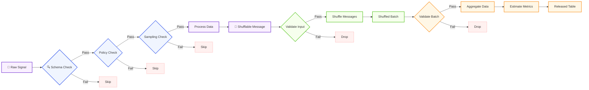

```mermaid
graph LR
    %% ==============================================
    %% SHUFFLE DP
    %% ==============================================
    
    %% CLIENT STAGE 
    A["📡 Raw Signal"] --> B{"🔍 Schema Check"}
    B -->|Pass| C{"Policy Check"}
    C -->|Pass| D{"Sampling Check"}
    D -->|Pass| E["Process Data"]
    E --> F["📨 Shufflable Message"]
    
    B -->|Fail| X["Skip"]
    C -->|Fail| Y["Skip"]
    D -->|Fail| Z["Skip"]
    
    %% SHUFFLER STAGE
    F --> G{"Validate Input"}
    G -->|Pass| H["Shuffle Messages"]
    H --> I["Shuffled Batch"]
    G -->|Fail| J["Drop"]
    
    %% SERVER STAGE
    I --> K{"Validate Batch"}
    K -->|Pass| L["Aggregate Data"]
    L --> M["Estimate Metrics"]
    M --> N["Released Table"]
    K -->|Fail| O["Drop"]
    
    %% ==============================================
    %% format
    %% ==============================================
    
    classDef clientData fill:#f9f0ff,stroke:#722ed1,stroke-width:2px,minWidth:150px
    classDef clientGate fill:#f0f5ff,stroke:#2f54eb,stroke-width:2px,minWidth:150px
    classDef clientProcess fill:#f9f0ff,stroke:#722ed1,stroke-width:2px,minWidth:150px
    
    classDef shufflerData fill:#f6ffed,stroke:#52c41a,stroke-width:2px,minWidth:150px
    classDef shufflerGate fill:#f6ffed,stroke:#52c41a,stroke-width:2px,minWidth:150px
    classDef shufflerProcess fill:#f6ffed,stroke:#52c41a,stroke-width:2px,minWidth:150px
    
    classDef serverData fill:#fff7e6,stroke:#fa8c16,stroke-width:2px,minWidth:150px
    classDef serverGate fill:#fff7e6,stroke:#fa8c16,stroke-width:2px,minWidth:150px
    classDef serverProcess fill:#fff7e6,stroke:#fa8c16,stroke-width:2px,minWidth:150px
    classDef reject fill:#fff1f0,stroke:#ff4d4f,stroke-width:1px,stroke-dasharray: 3 3,minWidth:100px
    
    %% class
    class A,F clientData
    class B,C,D clientGate
    class E clientProcess
    class X,Y,Z reject
    
    class I shufflerData
    class G shufflerGate
    class H shufflerProcess
    class J reject
    
    class N serverData
    class K serverGate
    class L,M serverProcess
    class O reject
```
